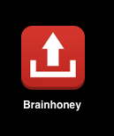
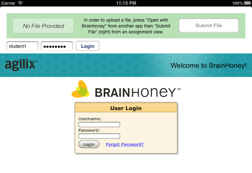

  
  <h1 style="color: white; float: right; margin-right: 30px; font-size: 30px">Brainhoney Uploader</h1>

This app is meant to allow iPad users to upload assignments to Brainhoney. It
achieves this by two primary innovations:

1. A file is imported through "Open with ..." buttons of other apps and cached
   for later uploading.
2. A web browser is used to render the Brainhoney website and observe assignment
   browsing. Once the user settles on an assignment, their choice, too, is cached.

# Implementation
Within the `Information` folder are a couple shell scripts meant to illustrate
the specifics of the uploading endpoint. The file `upload.sh` serves as a concise
summary of the endpoint's interface, and `example.sh` shows an example of usage
of the shell script.

# Interface
The user interface includes a status bar to guide the user in the process of
uploading a file. This is a unique design paradigm. Additionally, the idea of
importing a file and caching it for later use is novel.

# Inspiration
This app was designed and developed as a part of an Independent Study course at
Bishop Watterson High School. Students are allowed to bring their own devices;
one of the most popular of such devices is the iPad. However, these students are
left unable to directly submit their homework through Brainhoney. This app serves
to remove that obstacle.
