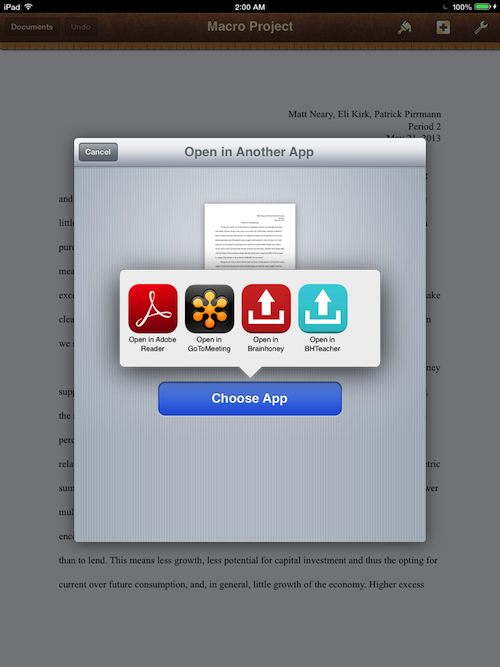

# Brainhoney Uploader

Both editions of the app are available through the App Store: the 
[Student](https://itunes.apple.com/us/app/bhstudent/id763152364?ls=1&mt=8) &
[Teacher](https://itunes.apple.com/us/app/bhteacher/id763140069?ls=1&mt=8) versions.

This app is meant to allow iPad users to upload assignments to Brainhoney. It
achieves this by two primary innovations:

1. A file is imported through "Open with ..." buttons of other apps and cached
   for later uploading.
2. A web browser is used to render the Brainhoney website and observe assignment
   browsing. Once the user settles on an assignment, their choice, too, is cached.

The means of importing the file will look something like the following, depending
on the app from which the file is being exported.

# Implementation
Within the `Information` folder are a couple shell scripts meant to illustrate
the specifics of the uploading endpoint. The file `upload.sh` serves as a concise
summary of the student-endpoint's interface, and `example.sh` shows an example of usage
of the shell script. The scripts `assign-sh` and `teacherUpload.sh` illustrate
their respective functions for a teacher account.

Access of attachments is also an issue for iPad users. To combat this, a button
is provided which parses out and renders all attachment links in a usable way.

# Interface
The user interface includes a status bar to guide the user in the process of
uploading a file. This is a unique design paradigm. Additionally, the idea of
importing a file and caching it for later use is novel.

