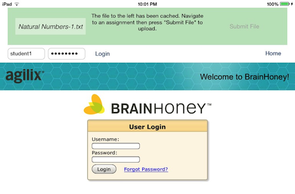

# Brainhoney Uploader

This app is meant to allow iPad users to upload assignments to Brainhoney. It
achieves this by two primary innovations:

1. A file is imported through "Open with ..." buttons of other apps and cached
   for later uploading.
2. A web browser is used to render the Brainhoney website and observe assignment
   browsing. Once the user settles on an assignment, their choice, too, is cached.

# Implementation
Within the `Information` folder are a couple shell scripts meant to illustrate
the specifics of the uploading endpoint. The file `upload.sh` serves as a concise
summary of the student-endpoint's interface, and `example.sh` shows an example of usage
of the shell script. The scripts `assign-sh` and `teacherUpload.sh` illustrate
their respective functions for a teacher account.

The actions work just as they do in the browser. Currently, the issue of the iPad
not using cookies does not allow for successful uploads through the teacher
adition. To combat this, we will need to perform all requests maunally, that is,
without a browser interface. This seems the more robust method regardless of the
cookie situation.

# Interface
The user interface includes a status bar to guide the user in the process of
uploading a file. This is a unique design paradigm. Additionally, the idea of
importing a file and caching it for later use is novel.

